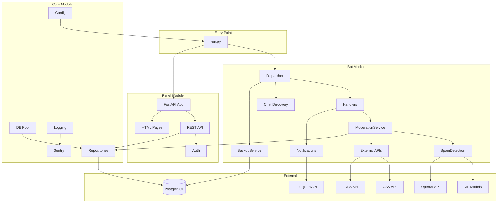
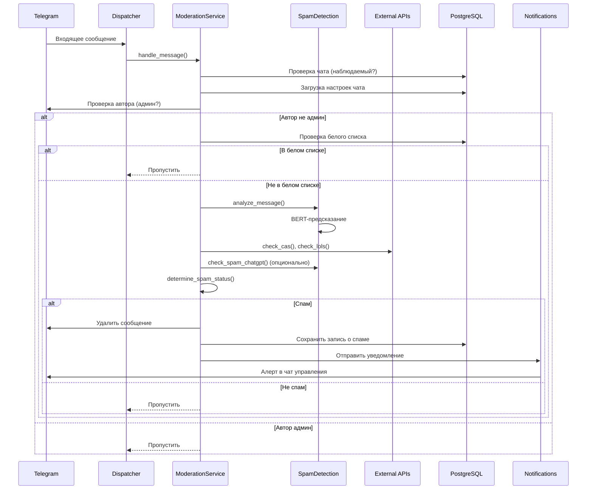
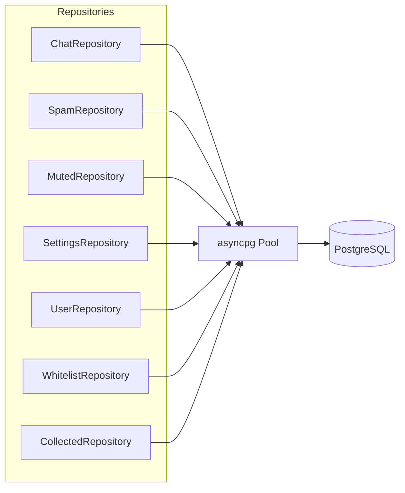

# Архитектура

Архитектура системы СТАНКИН Анти-Спам, компоненты и поток данных.

## Обзор

Система состоит из трёх основных компонентов, работающих в едином event loop:

- **Бот** (aiogram) — приём и обработка сообщений Telegram
- **Веб-панель** (FastAPI) — управление и мониторинг
- **Ядро** — общая инфраструктура: БД, конфигурация, логирование

## Запуск

Единый entry point — `run.py`. Поддерживает три режима:

- `--all` (по умолчанию) — бот и панель в одном event loop
- `--bot` — только бот
- `--panel` — только панель

При совместном запуске бот и панель разделяют общий пул соединений PostgreSQL. Сигналы SIGINT и SIGTERM обрабатываются для корректного завершения.

## Поток обработки сообщения

## Слой данных

Доступ к PostgreSQL организован через паттерн Repository. Все репозитории используют общий asyncpg connection pool.

| Репозиторий | Назначение |
| --- | --- |
| `ChatRepository` | Управление наблюдаемыми чатами |
| `SpamRepository` | Журнал обнаруженных спам-сообщений |
| `MutedRepository` | Ограниченные пользователи и история ограничений |
| `SettingsRepository` | Глобальные и per-chat настройки |
| `UserRepository` | Пользователи панели и права доступа к чатам |
| `WhitelistRepository` | Белый список пользователей, исключённых из проверки |
| `CollectedRepository` | Собранные сообщения (для анализа и обучения) |

## ML-детекция спама

Сервис `SpamDetection` использует многоуровневый подход:

1. **BERT-классификатор** — основная модель (ruBERT-tiny2), загружаемая через ONNX Runtime или transformers pipeline. Возвращает вероятность спама.

2. **Sklearn-ансамбль** — дополнительная проверка для серой зоны (когда BERT-уверенность между порогом уверенности и порогом спама). Использует TF-IDF и char-level признаки.

3. **ChatGPT** — опциональная проверка через OpenAI API для сообщений из серой зоны, когда BERT и sklearn не дают однозначного ответа.

4. **Внешние API** — проверка отправителя через CAS и LOLS. Если пользователь найден в базе спамеров, сообщение классифицируется как спам независимо от BERT.

Решение принимается в `ModerationService.determine_spam_status()` на основе совокупности всех проверок.

## Резервное копирование

`BackupService` создаёт дамп БД через `pg_dump`, вычисляет SHA-256 хеш и отправляет файл в Telegram-чат управления в указанный тред. Поддерживается как ручной запуск через API, так и автоматический по расписанию.
