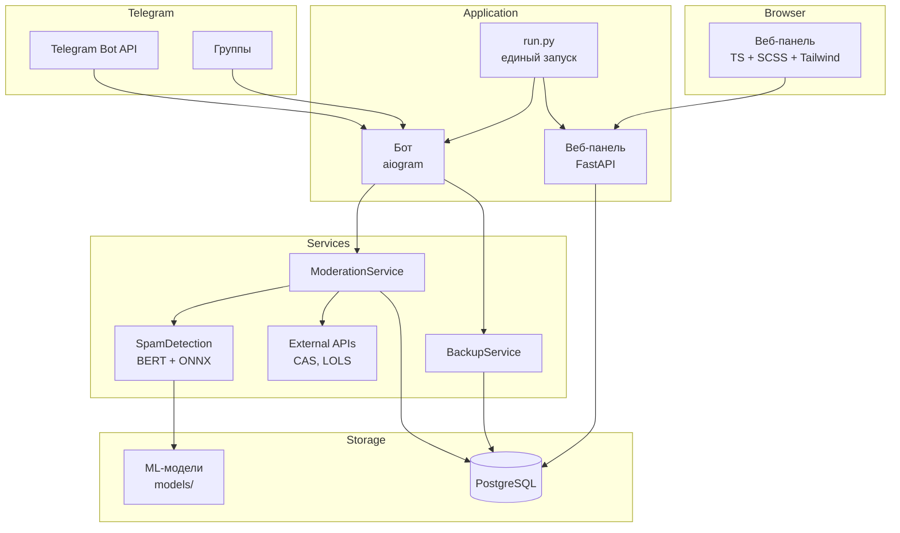

# СТАНКИН Анти-Спам

Система автоматической модерации Telegram-групп на основе ML-классификатора с веб-панелью управления.

[](https://github.com/overklassniy/STANKIN_AntiSpam_Bot/actions)
[](https://github.com/overklassniy/STANKIN_AntiSpam_Bot/pkgs/container/stankin_antispam_bot)
[](https://www.python.org/)
[](LICENSE)

## Оглавление

- [О проекте](#о-проекте)
- [Возможности](#возможности)
- [Технологии](#технологии)
- [Архитектура](#архитектура)
- [Быстрый старт](#быстрый-старт)
- [Структура проекта](#структура-проекта)
- [Документация](#документация)
- [Лицензия](#лицензия)

## О проекте

СТАНКИН Анти-Спам — система модерации Telegram-групп, которая автоматически обнаруживает и блокирует спам-сообщения. Проект разработан для университетских чатов, но применим в любых Telegram-сообществах.

Система анализирует каждое сообщение через BERT-классификатор, проверяет отправителя по внешним базам данных спамеров (CAS, LOLS) и при необходимости дополняет анализ через ChatGPT. Результаты модерации доступны через веб-панель с управлением настройками, просмотром журнала спама и списка ограниченных пользователей.

## Возможности

| Возможность | Описание |
| --- | --- |
| ML-детекция спама | BERT-классификатор (ruBERT-tiny2) с настраиваемыми порогами уверенности |
| Внешние проверки | Интеграция с CAS (Combot Anti-Spam) и LOLS (List of Lame Spammers) |
| ChatGPT-анализ | Опциональная дополнительная проверка через OpenAI API для серой зоны |
| Веб-панель управления | FastAPI-приложение с авторизацией, управлением настройками и журналами |
| Per-chat настройки | Индивидуальные пороги и проверки для каждого чата |
| Автообнаружение чатов | Автоматический поиск групп, где бот является администратором |
| Уведомления | Отправка алертов о спаме в чат управления с inline-кнопками |
| Резервное копирование | Автоматические бэкапы БД через pg_dump с отправкой в Telegram |
| Мониторинг ошибок | Интеграция с Sentry для трекинга исключений и логирования |
| Контейнеризация | Docker-образ с многостадийной сборкой, готовый к deploy через docker-compose |

## Технологии

| Категория | Технологии |
| --- | --- |
| Backend | Python 3.14+, aiogram 3.x, FastAPI, uvicorn |
| База данных | PostgreSQL, asyncpg |
| ML | transformers, ONNX Runtime, scikit-learn, scipy |
| Фронтенд | TypeScript, SCSS, Tailwind CSS |
| Инфраструктура | Docker, GitHub Actions, Sentry |
| Внешние API | Telegram Bot API, CAS, LOLS, OpenAI |

## Архитектура



Система запускается через единый entry point (`run.py`), который поднимает бота и веб-панель в одном event loop. Бот и панеля разделяют общий пул соединений PostgreSQL. Подробное описание архитектуры — в [.docs/architecture.md](.docs/architecture.md).

## Быстрый старт

### Требования

- Docker и Docker Compose
- Telegram-бот (токен от [@BotFather](https://t.me/BotFather))
- PostgreSQL 14+

### Установка

1. Склонируйте репозиторий:

```bash
git clone https://github.com/overklassniy/STANKIN_AntiSpam_Bot.git
cd STANKIN_AntiSpam_Bot
```

2. Создайте файл `.env` на основе `.env.example` и заполните обязательные переменные:

```bash
cp .env.example .env
# Отредактируйте .env: BOT_TOKEN, DATABASE_URL, SECRET_KEY, NOTIFICATION_CHAT_ID
```

3. Запустите через Docker Compose:

```bash
docker compose up -d
```

Веб-панель будет доступна по адресу `http://localhost:12523`.

Для получения пароля доступа к панели отправьте команду `/get_password` боту в личные сообщения.

Подробные инструкции по установке — в [.docs/installation.md](.docs/installation.md).

## Структура проекта

```
STANKIN_AntiSpam_Bot/
├── bot/                # Telegram-бот: обработчики, сервисы модерации
├── core/               # Ядро: конфигурация, БД, репозитории, логирование
├── panel/              # Веб-панель: FastAPI, REST API, фронтенд
├── .docs/              # Детальная документация
├── Dockerfile          # Многостадийная сборка Docker-образа
├── docker-compose.yml  # Конфигурация для deploy
├── run.py              # Единый entry point
├── requirements.txt    # Python-зависимости
└── package.json        # Node.js зависимости для сборки фронтенда
```

Описание каждого модуля — в README соответствующей директории:

- [bot/README.md](bot/README.md) — модуль Telegram-бота
- [core/README.md](core/README.md) — ядро и инфраструктура
- [panel/README.md](panel/README.md) — веб-панель управления

## Документация

| Документ | Содержание |
| --- | --- |
| [.docs/installation.md](.docs/installation.md) | Требования, локальная установка, Docker |
| [.docs/configuration.md](.docs/configuration.md) | Переменные окружения, настройки в БД, пороги BERT |
| [.docs/architecture.md](.docs/architecture.md) | Архитектура системы, поток данных, компоненты |
| [.docs/api.md](.docs/api.md) | REST API эндпоинты, аутентификация, Scalar |
| [.docs/deployment.md](.docs/deployment.md) | Docker deploy, CI/CD, мониторинг, бэкапы |
| [.docs/development.md](.docs/development.md) | Настройка окружения разработки, сборка фронтенда |

## Лицензия

Проект распространяется под лицензией [MIT](LICENSE).
