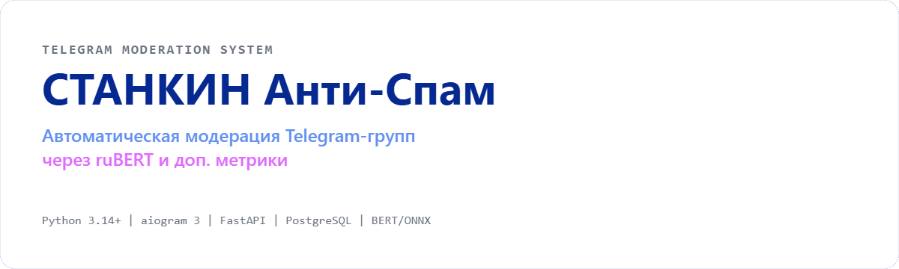
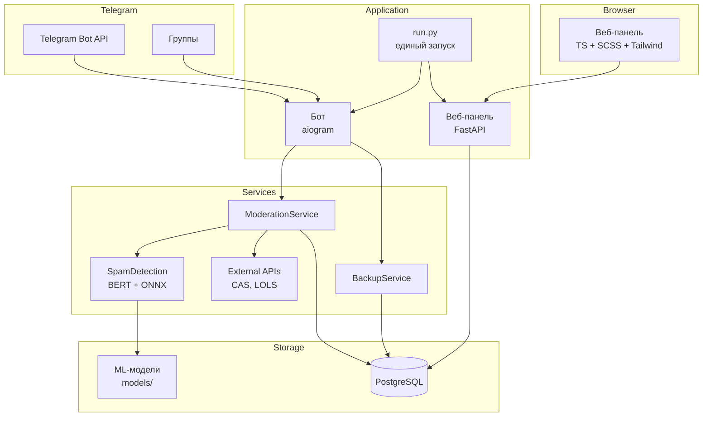

# СТАНКИН Анти-Спам

<p align="center">
  
</p>

<p align="center">
  <a href="https://github.com/overklassniy/STANKIN_AntiSpam_Bot/actions/workflows/docker-publish.yml"></a>
  <a href="https://github.com/overklassniy/STANKIN_AntiSpam_Bot/pkgs/container/stankin_antispam_bot"></a>
  
  
  
  
  
  
  
</p>

## О проекте

Система модерации Telegram-групп, которая автоматически обнаруживает и блокирует спам-сообщения. Проект разработан для университетских чатов, но применим в любых Telegram-сообществах.

Система анализирует каждое сообщение через BERT-классификатор, проверяет отправителя по внешним базам данных спамеров (CAS, LOLS) и при необходимости дополняет анализ через ChatGPT. Результаты модерации доступны через веб-панель с управлением настройками, просмотром журнала спама и списка ограниченных пользователей.

## Возможности

- **ML-детекция спама** – BERT-классификатор (ruBERT-tiny2) с настраиваемыми порогами уверенности.
- **Внешние проверки** – интеграция с CAS (Combot Anti-Spam) и LOLS (List of Lame Spammers).
- **ChatGPT-анализ** – опциональная дополнительная проверка через OpenAI API для серой зоны.
- **Веб-панель управления** – FastAPI-приложение с авторизацией, управлением настройками и журналами.
- **Per-chat настройки** – индивидуальные пороги и проверки для каждого чата.
- **Автообнаружение чатов** – автоматический поиск групп, где бот является администратором.
- **Уведомления** – отправка алертов о спаме в чат управления с inline-кнопками.
- **Резервное копирование** – автоматические бэкапы БД через pg_dump с отправкой в Telegram.
- **Мониторинг ошибок** – интеграция с Sentry для трекинга исключений и логирования.
- **Контейнеризация** – Docker-образ с многостадийной сборкой, готовый к deploy через docker-compose.

## Технологии

- **Backend** – Python 3.14+, aiogram 3.x, FastAPI, uvicorn.
- **База данных** – PostgreSQL, asyncpg.
- **ML** – transformers, ONNX Runtime, scikit-learn, scipy.
- **Фронтенд** – TypeScript, SCSS, Tailwind CSS.
- **Инфраструктура** – Docker, GitHub Actions, Sentry.
- **Внешние API** – Telegram Bot API, CAS, LOLS, OpenAI.

## Архитектура


```mermaid
graph TB
    subgraph Telegram
        TG[Telegram Bot API]
        CHATS[Группы]
    end

    subgraph Application
        BOT[Бот<br/>aiogram]
        PANEL[Веб-панель<br/>FastAPI]
        RUN[run.py<br/>единый запуск]
    end

    subgraph Services
        MOD[ModerationService]
        SPAM[SpamDetection<br/>BERT + ONNX]
        EXT[External APIs<br/>CAS, LOLS]
        BACKUP[BackupService]
    end

    subgraph Storage
        DB[(PostgreSQL)]
        MODELS[ML-модели<br/>models/]
    end

    subgraph Browser
        UI[Веб-панель<br/>TS + SCSS + Tailwind]
    end

    TG --> BOT
    CHATS --> BOT
    BOT --> MOD
    MOD --> SPAM
    MOD --> EXT
    MOD --> DB
    SPAM --> MODELS
    BOT --> BACKUP
    BACKUP --> DB
    RUN --> BOT
    RUN --> PANEL
    PANEL --> DB
    UI --> PANEL
```

Система запускается через единый entry point (`run.py`), который поднимает бота и веб-панель в одном event loop. Бот и панель разделяют общий пул соединений PostgreSQL. Подробное описание архитектуры – в [.docs/architecture.md](.docs/architecture.md).

## Быстрый старт

### Требования

- Docker и Docker Compose
- Telegram-бот (токен от [@BotFather](https://t.me/BotFather))
- PostgreSQL 18+

### Установка

1. Склонируйте репозиторий:

```bash
git clone https://github.com/overklassniy/STANKIN_AntiSpam_Bot.git
cd STANKIN_AntiSpam_Bot
```

2. Создайте файл `.env` на основе `.env.example` и заполните обязательные переменные:

```bash
cp .env.example .env
# Отредактируйте .env: BOT_TOKEN, DATABASE_URL, SECRET_KEY, NOTIFICATION_CHAT_ID
```

3. Запустите через Docker Compose:

```bash
docker compose up -d
```

Веб-панель будет доступна по адресу `http://localhost:12523`.

Для получения пароля доступа к панели отправьте команду `/get_password` боту в личные сообщения.

Подробные инструкции по установке – в [.docs/installation.md](.docs/installation.md).

## Структура проекта

```
STANKIN_AntiSpam_Bot/
  bot/                 Telegram-бот: обработчики, сервисы модерации
  core/                Ядро: конфигурация, БД, репозитории, логирование
  panel/               Веб-панель: FastAPI, REST API, фронтенд
  .docs/               Детальная документация
  Dockerfile           Многостадийная сборка Docker-образа
  docker-compose.yml   Конфигурация для deploy
  run.py               Единый entry point
  requirements.txt     Python-зависимости
  package.json         Node.js зависимости для сборки фронтенда
```

Описание каждого модуля – в README соответствующей директории:

- [bot/README.md](bot/README.md) – модуль Telegram-бота
- [core/README.md](core/README.md) – ядро и инфраструктура
- [panel/README.md](panel/README.md) – веб-панель управления

## Документация

- [.docs/installation.md](.docs/installation.md) – требования, локальная установка, Docker.
- [.docs/configuration.md](.docs/configuration.md) – переменные окружения, настройки в БД, пороги BERT.
- [.docs/architecture.md](.docs/architecture.md) – архитектура системы, поток данных, компоненты.
- [.docs/api.md](.docs/api.md) – REST API эндпоинты, аутентификация, Scalar.
- [.docs/deployment.md](.docs/deployment.md) – Docker deploy, CI/CD, мониторинг, бэкапы.
- [.docs/development.md](.docs/development.md) – настройка окружения разработки, сборка фронтенда.

## Ветка research

Ветка [`research`](https://github.com/overklassniy/STANKIN_AntiSpam_Bot/tree/research) содержит исследовательскую часть проекта:

- разведывательный анализ данных (EDA) собранного датасета сообщений;
- эксперименты с моделями классификации (BERT, sklearn-пайплайны, ансамбли);
- подбор гиперпараметров через Optuna с кросс-валидацией;
- сравнение метрик (F1, precision, recall) и выбор лучшей модели;
- Jupyter-ноутбуки с воспроизводимыми экспериментами;
- скрипты обучения и сохранения моделей в директорию `models/`.

Результаты исследований переносятся в основную ветку `master` в виде обученных моделей и настроек порогов классификации.

## Лицензия

Проект распространяется под лицензией [MIT](LICENSE).
